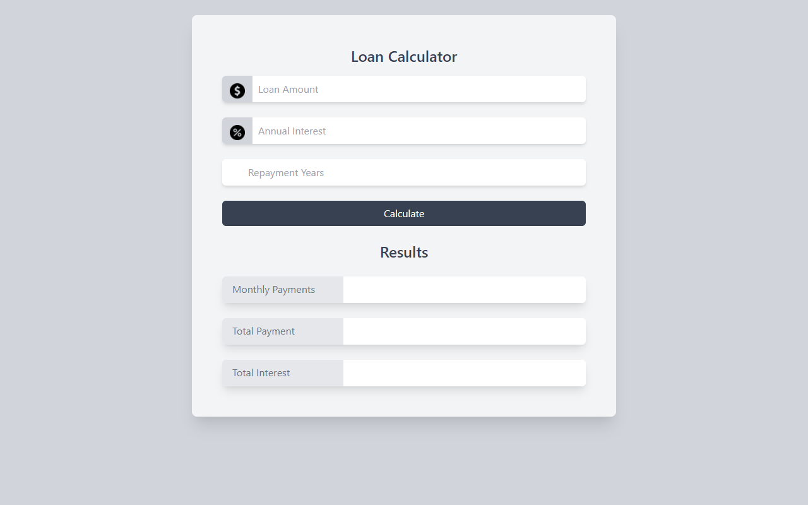
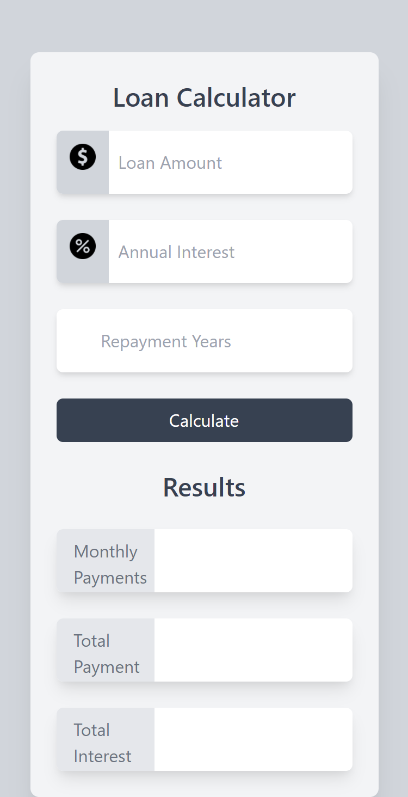

# Loan Calculator

This is a loan calculator web application built with Vanilla JS and TailwindCSS.
###Preview

### Screenshot

            This is a desktop View.

             This is for mobile view.

   
  

### Links

- Live Site URL: https://loancalculators.netlify.app/

### Built with

- Semantic HTML5 markup
- Tailwind CSS
- Vanilla JS

## Author

- Website -`https://AlbertSigsbert.github.io/Portfolio/`
- Frontend Mentor -https://www.frontendmentor.io/profile/AlbertSigsbert
- Twitter - https://twitter.com/albert_sigsbert
